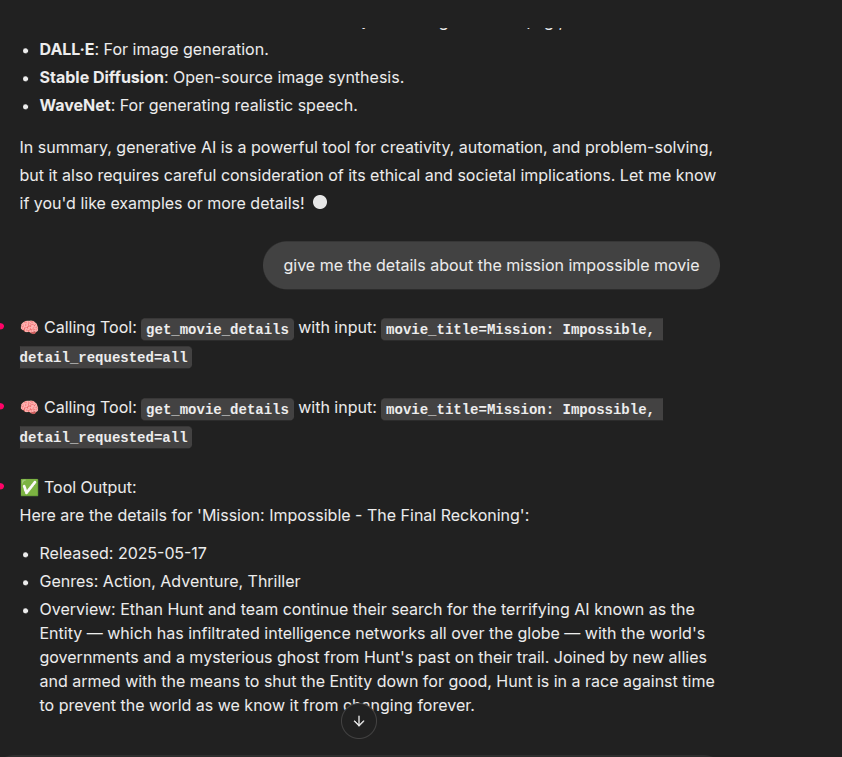

# Chainlit Multi-Model AI Chatbot

This project implements a versatile AI chatbot using Chainlit, designed to leverage different large language models (LLMs) and custom tools to provide a dynamic and interactive conversational experience. Users can switch between various AI "personalities" (models) and utilize specific functionalities like fetching movie details or generating poetry.

## Features

- **Multi-Model Support**: Integrated with OpenRouter to allow switching between different LLMs (e.g., DeepSeek Chat, Google Gemini Flash, Mistral Small).
- **Dynamic Profile Switching**: Users can easily change the active AI model from the Chainlit UI's chat profiles setting.
- **Tool Calling**: The chatbot is equipped with custom tools for:
  - **Movie Details**: Retrieve information about films (e.g., release date, genres, overview).
  - **Poetry Generation**: Generate creative poems based on user prompts.
- **Universal Starter Prompts**: Provides a consistent set of clickable starter questions, regardless of the selected AI model, to guide user interaction.
- **Chat History Persistence**: Automatically saves chat history to a JSON file.
- **Modular Design**: Clear separation of application logic (`app.py`) and tool definitions (`tools.py`).

## Tech Stack

- **Python 3.8+**
- **Chainlit**: For building the conversational UI.
- **OpenRouter**: For accessing various large language models.
- **`openai` library (AsyncOpenAI)**: Used as the client for OpenRouter.
- **`agents` SDK**: The core framework for agent-based logic and tool orchestration.
- **`python-dotenv`**: For managing environment variables.
- **`tmdbsimple`**: Python wrapper for the TMDB API (for movie details tool).
- **`requests`**: For making HTTP requests (used by some tools).

## Setup

Follow these steps to get the project up and running on your local machine.

### Prerequisites

- Python 3.8 or higher
- `pip` (Python package installer)

### 1. Clone the Repository

```bash
git clone <your-repository-url>
cd <your-project-directory> # e.g., cd chatbot_06
```



